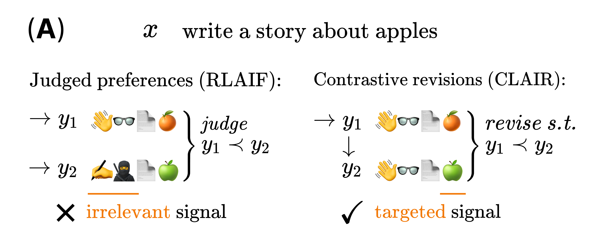
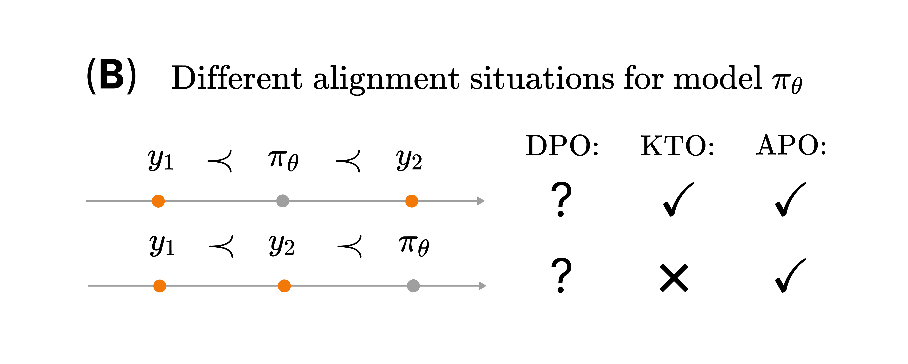
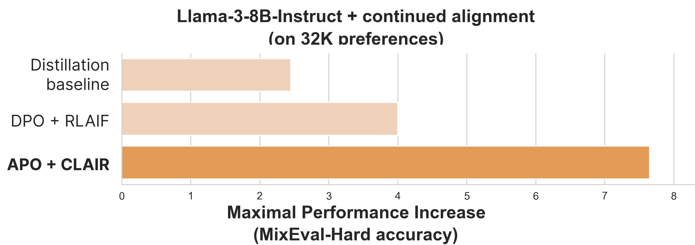

# Anchored Preference Optimization and Contrastive Revisions: Addressing Underspecification in Alignment

- [Paper](https://arxiv.org/abs/2408.06266#) 
- [Blogpost](https://contextual.ai/addressing-underspecification-in-language-model-alignment)
- [Data on HuggingFace](https://huggingface.co/collections/ContextualAI/clair-and-apo-66b52868672bb1c984d1f3d5)
- [Data Notebook](https://colab.research.google.com/github/ContextualAI/CLAIR_and_APO/blob/master/CLAIR_preferences.ipynb)
- Models: coming soon.


Alignment is underspecified with regard to preference and training objectives. We tackle this along two predominant axes: alignment data and alignment algorithms. 


First, we introduce **Contrastive Learning from AI Revisions (CLAIR)**. CLAIR uses a secondary AI system to minimally revise a solution A→A’ such that the resulting preference A < A’ is much more contrastive and precise.

Second, we introduce **Anchored Preference Optimization (APO)**. APO uses simple constraints during training to account for the relationship between the model and preference data.


<div style="display: flex; flex-wrap: wrap; justify-content: space-around; align-items: center;">
  <div style="flex: 1; margin: 10px; min-width: 300px;">
    
  </div>
  
  <div style="flex: 1; margin: 10px; min-width: 300px;">
    
  </div>
</div>

**A:** Preference pairs can vary along irrelevant axes, Contrastive Learning from AI Revisions (CLAIR) creates a targeted preference signal instead. 
**B:** The quality of the model can impact alignment training, Anchored Preference Optimization (APO) explicitly accounts for this.

Compared to conventional methods, we’ve observed a ~2x performance boost on [MixEval-Hard](https://mixeval.github.io) for continued alignment of Llama-3-8B-Instruct.

<div style="flex: 1; margin: 10px auto; min-width: 300px; max-width: 500px;">
    
</div>

## Contrastive Learning From AI Revisions (CLAIR)
We've given a reference implementation of CLAIR in [this notebook](https://github.com/ContextualAI/CLAIR_and_APO/blob/master/CLAIR_preferences.ipynb). Results are cached so you can run it without an API key.

[](https://colab.research.google.com/github/ContextualAI/CLAIR_and_APO/blob/master/CLAIR_preferences.ipynb)

## Anchored Preference Optimization (APO)
APO is integrated in the [TRL repository](https://github.com/huggingface/trl).
First, install trl. Then, run either APO-zero (`apo_zero`) or APO-down (`apo_down`) using the `trl dpo` command.

``` 
pip install git+https://github.com/huggingface/trl.git
``` 
``` 
trl dpo \
    --loss_type apo_zero \
    --dataset_name ContextualAI/ultrafeedback_clair_32k \
    --model_name_or_path facebook/opt-125m \
    --output_dir results
```

## Citation
If you found CLAIR and APO useful, please cite:

```
@misc{doosterlinck2024anchored,
      title={Anchored Preference Optimization and Contrastive Revisions: Addressing Underspecification in Alignment}, 
      author={Karel D'Oosterlinck and Winnie Xu and Chris Develder and Thomas Demeester and Amanpreet Singh and Christopher Potts and Douwe Kiela and Shikib Mehri},
      year={2024},
      eprint={2408.06266},
      archivePrefix={arXiv},
      primaryClass={cs.LG},
      url={https://arxiv.org/abs/2408.06266}, 
}
```
